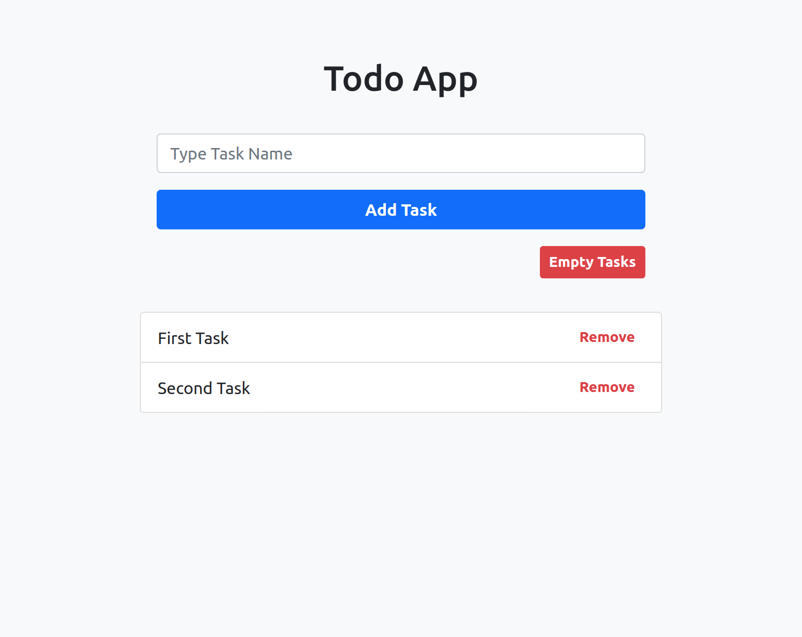

# Todo App

This is a simple Todo Webapp.

## Available Scripts

In the project directory, you can run:

### `yarn start`

Runs the app in the development mode.\
Open [http://localhost:3000](http://localhost:3000) to view it in the browser.

## Buit with

- [Bootstrap](https://getbootstrap.com/)
- [React.js](https://reactjs.org/)